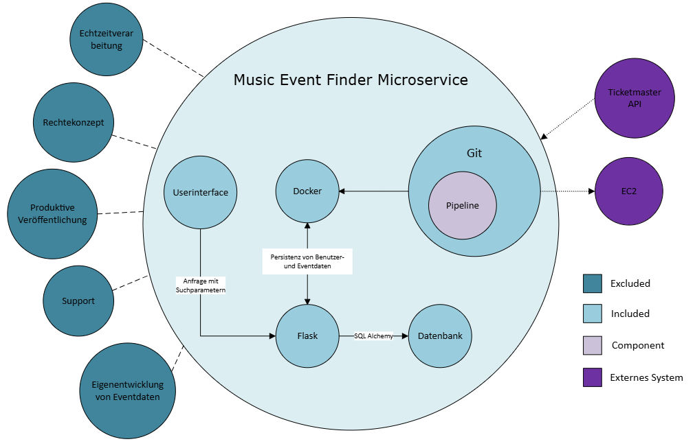

# Teil 2 Konzeption

Nun gehen wir ins Thema Konzeption über. In diesem Kapitel wird das ganze Projekt vorbereitet. Die Ausgangslage und Anforderungen werden beschrieben, auch was das Ziel des Projektes ist, wird aufgezeigt. Die Planung wird gemacht und es werden Entscheidungen getroffen um das Projekt mit den Optimalen Tools umzusetzten.

- [Teil 2 Konzeption](#teil-2-konzeption)
- [Informieren](#informieren)
  - [Was ist SCRUM?](#was-ist-scrum)
    - [Die wichtigsten Merkmale](#die-wichtigsten-merkmale)
    - [Die zentralen Rollen](#die-zentralen-rollen)
    - [Die wichtigsten Ereignisse (Events)](#die-wichtigsten-ereignisse-events)
    - [Zentrale Artefakte](#zentrale-artefakte)
    - [Wieso SCRUM](#wieso-scrum)
  - [Ausgangslage \& Motivation](#ausgangslage--motivation)
  - [Anforderungen erheben](#anforderungen-erheben)
  - [Relevanz und Nutzen eines Event-Finders](#relevanz-und-nutzen-eines-event-finders)
  - [Seusag](#seusag)
    - [Enthaltene (Included) Elemente](#enthaltene-included-elemente)
      - [Userinterface](#userinterface)
      - [Flask](#flask)
      - [Datenbank](#datenbank)
      - [SQLAlchemy](#sqlalchemy)
      - [Docker](#docker)
      - [Git](#git)
      - [EC2 (AWS)](#ec2-aws)
      - [Ticketmaster API](#ticketmaster-api)
    - [Komponenten (Component)](#komponenten-component)
      - [Pipeline](#pipeline)
    - [Ausgeschlossene (Excluded) Elemente](#ausgeschlossene-excluded-elemente)
      - [Echtzeitverarbeitung](#echtzeitverarbeitung)
      - [Rechtekonzept](#rechtekonzept)
      - [Produktive Veröffentlichung](#produktive-veröffentlichung)
      - [Support](#support)
      - [Eigenentwicklung von Eventdaten](#eigenentwicklung-von-eventdaten)
- [Planen](#planen)
  - [Zeitplan](#zeitplan)
  - [Meilensteine](#meilensteine)
    - [Initialisierung](#initialisierung)
    - [Konzeption](#konzeption)
    - [Realisieren](#realisieren)
    - [Abschluss](#abschluss)
  - [Ist und Soll](#ist-und-soll)
  - [Implementierungsplan](#implementierungsplan)
- [Entscheiden](#entscheiden)
  - [Systemarchitektur](#systemarchitektur)
  - [Technologieentscheidungen](#technologieentscheidungen)
  - [API-Auswahl](#api-auswahl)
  - [Entscheidungsmatrix](#entscheidungsmatrix)

# Informieren

In diesem Kapitel werde ich alle Informationen zusammentragen, um das Projekt umsetzten zu können.

## Was ist SCRUM?

SCRUM ist ein agiles Rahmenwerk (Framework) für Projektmanagement, das vor allem in der Softwareentwicklung eingesetzt wird. Es hilft Teams, komplexe Projekte schrittweise zu bearbeiten und regelmäßig Ergebnisse zu liefern.

### Die wichtigsten Merkmale

- Iterativ und inkrementell: Die Arbeit wird in festen Zeitabschnitten, sogenannten Sprints (meist 2–4 Wochen), erledigt.
- Transparenz, Überprüfung und Anpassung: Nach jedem Sprint wird das Ergebnis vorgestellt und gegebenenfalls der Plan angepasst.

### Die zentralen Rollen

- Product Owner – Verantwortlich für das Produkt und dessen Anforderungen (Pflege des Product Backlogs).
- Scrum Master – Unterstützt das Team, entfernt Hindernisse und sorgt für die Einhaltung von SCRUM.
- Entwicklungsteam – Umsetzt die Anforderungen und liefert am Ende eines Sprints ein fertiges Produktinkrement.

### Die wichtigsten Ereignisse (Events)

- Sprint Planning – Planung, was im kommenden Sprint erreicht werden soll.
- Daily Scrum – Tägliches 15-Minuten-Meeting zur Abstimmung.
- Sprint Review – Vorstellung der Ergebnisse am Sprintende.
- Sprint Retrospective – Rückblick auf den Sprint zur Prozessverbesserung.

### Zentrale Artefakte

- Product Backlog – Liste aller Anforderungen an das Produkt.
- Sprint Backlog – Auswahl der Aufgaben für den aktuellen Sprint.
- Increment – Das am Ende eines Sprints fertige und getestete Produktstück.

> (Chat GPT) [Quelle](https://chatgpt.com/share/6818f168-0354-800e-8c00-119b2ed7c509)

### Wieso SCRUM

Ich habe mich bewusst für SCRUM als Vorgehensmodell entschieden, weil es ein etabliertes, agiles Framework ist. SCRUM ermöglicht es, in kurzen Zyklen (Sprints) kontinuierlich funktionsfähige Ergebnisse zu liefern, die regelmäßig überprüft und angepasst werden können.

Durch die klare Struktur, regelmäßigen Events (Sprint Planning, Sprint Review, Retrospektive) und einem fokussierten Backlog-Management entsteht ein hohes Maß an Transparenz, Planbarkeit und Flexibilität.

Ein weiterer entscheidender Vorteil von SCRUM ist die enge Einbindung von Feedback. So kann frühzeitig auf Veränderungen oder neue Erkenntnisse reagiert werden, ohne die gesamte Projektplanung überarbeiten zu müssen. Das fördert eine nutzerzentrierte Entwicklung und reduziert das Risiko, am Bedarf vorbei zu arbeiten.

Zusätzlich haben wir im Unterricht SCRUM Theoretisch angeschaut und nun kann ich es Praktisch lernen umzusetzten.

> (Chat GPT) [Quelle](https://chatgpt.com/share/68230b9b-2d9c-800e-a1eb-64bd9fe8ed96)

## Ausgangslage & Motivation

In Zeiten zunehmender Digitalisierung und Vernetzung steigt das Bedürfnis nach personalisierten Diensten. Musikliebhaber:innen suchen gezielt nach Veranstaltungen, die ihren Interessen entsprechen und gleichzeitig gut erreichbar sind. Der Markt bietet zwar verschiedene Event-Plattformen, doch häufig fehlt es an einer modularen, leicht integrierbaren Lösung, die als eigenständiger Microservice betrieben werden kann.
Diese Lücke soll durch die Entwicklung eines Microservices geschlossen werden, der gezielt ortsbezogene Event-Empfehlungen im Musikbereich ermöglicht. Die persönliche Affinität zur Thematik, das Interesse an Microservice-Architekturen und der technologische Reiz motivieren zusätzlich zur Umsetzung des Vorhabens.

## Anforderungen erheben

Für die Entwicklung eines effektiven Event-Finders sind verschiedene funktionale und nicht-funktionale Anforderungen zu berücksichtigen:

Funktionale Anforderungen:

- REST-API zur Abfrage von Musikveranstaltungen
- Anbindung an eine externe Event-API (z. B. Ticketmaster, Eventbrite)
- Filteroptionen nach Ort, Datum, Genre, etc.
- Speicherung und Verwaltung von Nutzerinformationen
- Personalisierte Empfehlungen auf Basis von Nutzerpräferenzen

Nicht-funktionale Anforderungen:

- Bereitstellung über eine CI/CD-Pipeline in AWS
- Containerisierung mit Docker für einfache Skalierbarkeit und Portabilität
- Skalierbare, wartbare Architektur (Microservice-Prinzip)
- Sichere und DSGVO-konforme Datenverarbeitung

## Relevanz und Nutzen eines Event-Finders

Ein Event-Finder bietet für Nutzer/innen einen klaren Mehrwert: Statt selbst mühsam nach Veranstaltungen zu suchen, erhalten sie gezielte, persönliche Empfehlungen abgestimmt auf Standort, Musikgeschmack und Verfügbarkeit.
Auch für Plattformbetreiber oder Drittanbieter ist der Microservice interessant: Dank seiner modularen Architektur lässt er sich flexibel in bestehende Systeme integrieren. So entstehen neue Möglichkeiten für personalisiertes Marketing, datenbasierte Entscheidungen und Nutzerbindung.
Der Einsatz moderner Technologien wie Docker, REST-APIs und Cloud-Deployment sorgt zudem für Zukunftsfähigkeit und erleichtert die Wartung sowie Weiterentwicklung des Systems.

> (Chat GPT) [Quelle](https://chatgpt.com/share/681ca14f-3adc-800e-999e-442e39898a6b)

## Seusag

### Enthaltene (Included) Elemente

#### Userinterface
Das User Interface dient zur Visualisierung der API-Endpunkte. Es wird als einfache Web-Oberfläche fungieren, die Suchparameter an das Backend weitergibt.

#### Flask
Das Backend-Framework bildet das zentrale Element des Microservices. Es implementiert die REST-API, verarbeitet Anfragen, leitet sie an die Filterlogik weiter und koordiniert alle internen Prozesse.

#### Datenbank
Hier werden Benutzerinformationen, Präferenzen oder Filtereinstellungen, gespeichert. Eine relationale Datenbank ist über SQLAlchemy angebunden.

#### SQLAlchemy
Es ermöglicht eine objektorientierte Datenbankanbindung und erleichtert Datenmanipulation und -abfragen.

#### Docker
Zur Containerisierung des Services wird Docker eingesetzt. Damit ist der Microservice unabhängig von der Umgebung lauffähig, lokal oder in der Cloud (AWS EC2).

#### Git
Der Code wird versionsverwaltet mit Git. Dies ermöglicht saubere Entwicklungsprozesse, Branching und Pull Requests.

#### EC2 (AWS)
Der Microservice wird auf einem Amazon EC2-Server deployed. EC2 stellt eine skalierbare Cloud-Infrastruktur für den produktionsnahen Betrieb des Containers bereit.

#### Ticketmaster API
Diese externe Event-API liefert Eventdaten. Sie wird konsumiert, aber nicht beeinflusst oder erweitert. Andere APIs könnten ebenfalls eingebunden werden.

### Komponenten (Component)

#### Pipeline
Die Pipeline automatisiert den Build-, Test- und Deploymentprozess. Bei jedem Commit oder Merge kann die Anwendung automatisch gebaut, getestet und auf EC2 ausgerollt werden.

### Ausgeschlossene (Excluded) Elemente

#### Echtzeitverarbeitung
Der Service arbeitet nicht mit Live-Datenströmen. Daten werden per Anfrage oder geplanten Intervallen abgerufen – keine Echtzeit-Ereignisverarbeitung.

#### Rechtekonzept
Es wird kein Rollen- oder Berechtigungsmanagement umgesetzt. Alle Anfragen werden als gleichberechtigte Benutzer behandelt einfache API-Nutzung ohne Benutzerrollen.

#### Produktive Veröffentlichung
Der Service wird nicht öffentlich zugänglich gemacht oder als dauerhaft produktiv betrieben. Die Veröffentlichung dient nur zu Demonstrations- und Evaluierungszwecken.

#### Support
Es wird kein laufender Benutzersupport oder operativer Betrieb vorgesehen. Fokus liegt auf technischer Umsetzung und Nachweis der Funktionalität.

#### Eigenentwicklung von Eventdaten
Es werden keine eigenen Eventdaten gepflegt oder manuell eingegeben. Alle Eventinformationen stammen ausschließlich aus der angebundenen Drittanbieter-API.

# Planen

Hier werde ich das ganze Projekt planen. Es wird ein Zeitplan erstellt, wann welche Tätigkeiten fällig sind und die Meilensteine sind genau beschrieben.

## Zeitplan

## Meilensteine
### Initialisierung

In der Initialisierungsphase wird das Projekt offiziell gestartet. Ziel ist es, eine klare Projektgrundlage zu schaffen. Dazu gehören die Definition von Zielen, die Identifikation von Stakeholdern, die grobe Planung (Zeit, Budget, Ressourcen) sowie die Erstellung eines Projektauftrags. Risiken und Chancen werden frühzeitig analysiert, und es wird geprüft, ob das Projekt wirtschaftlich und realistisch durchführbar ist.

### Konzeption

In dieser Phase wird das Projekt inhaltlich konkretisiert. Anforderungen werden detailliert erhoben und dokumentiert (z. B. als User Stories), Lösungsansätze erarbeitet und bewertet. Es entsteht ein Fach- und ggf. ein technisches Konzept, das die Grundlage für die spätere Umsetzung bildet.

### Realisieren

Jetzt beginnt die eigentliche Umsetzung: Entwicklung, Konfiguration, Tests und Integration der Komponenten. Die Arbeit erfolgt meist iterativ (z. B. in Sprints), um regelmäßig funktionierende Zwischenstände zu liefern. Parallel erfolgt oft auch die Vorbereitung von Schulungen und die Erstellung von Benutzerdokumentationen.

### Abschluss

Das Projekt wird formal beendet. Es finden eine Abnahme, eine Übergabe an den Betrieb sowie ggf. eine Schulung der Nutzer statt. Außerdem werden Lessons Learned dokumentiert, um aus dem Projekt für zukünftige Vorhaben zu lernen.

## Ist und Soll

## Implementierungsplan

# Entscheiden

## Systemarchitektur

- Microservice-Architektur
- Datenfluss (z. B. von externer API zur DB)

## Technologieentscheidungen

- Warum Docker? Warum AWS? Warum bestimmte DB?

## API-Auswahl

Im Rahmen der Vorbereitung zur Anbindung einer Event API wird eine gezielte Marktanalyse durchgeführt, um geeignete Schnittstellen für die Eventdaten-Integration zu identifizieren und zu vergleichen. Ziel war es, eine API-Lösung auszuwählen, die zuverlässig, gut dokumentiert und für die geplanten Anwendungsfälle geeignet ist.

Im Vergleich standen unter anderem die Ticketmaster API und die Eventbrite API. Beide APIs bieten umfangreiche Daten zu Veranstaltungen, jedoch unterschieden sie sich in mehreren Aspekten:

| Kriterium             | Ticketmaster API                                           | Eventbrite API                                             |
|-----------------------|------------------------------------------------------------|------------------------------------------------------------|
| Datenbasis            | Große, internationale Event-Datenbank                      | Fokus auf lokale, kleinere Veranstaltungen                 |
| Dokumentation         | Sehr gut strukturiert und umfassend                        | Gut, mit vielen Beispielen                                 |
| Filtermöglichkeiten   | Umfangreich (Ort, Genre, Datum usw.)                       | Eingeschränkter Umfang                                     |
| Performance           | Sehr zuverlässig und performant                            | Variiert, abhängig von Umfang und Abfrage                  |
| Authentifizierung     | API-Key erforderlich, teilweise Registrierung für Details  | Einfache Authentifizierung                                 |
| Datenqualität         | Hoch, insbesondere bei Großveranstaltungen                 | Schwankend je nach Region und Veranstalter                 |
| Eventkategorien       | Breites Spektrum, gut strukturiert                         | Stärker auf Community-Events fokussiert                    |

Auf Basis dieser Analyse fiel die Entscheidung zugunsten der Ticketmaster API, da sie besser zu den Projektanforderungen in Bezug auf Datenqualität, Eventkategorien und internationale Verfügbarkeit passt.

> (Chat GPT) [Quelle](https://chatgpt.com/share/681cb603-08cc-800e-aab1-fdd14d015179)

## Entscheidungsmatrix

> Back [Page](https://github.com/lauradubach/Semesterarbeit3/blob/main/Sites/Teil%202%20Konzeption.md)
>
> Next [Page](https://github.com/lauradubach/Semesterarbeit3/blob/main/Sites/Teil%201%20Initialisierung.md)