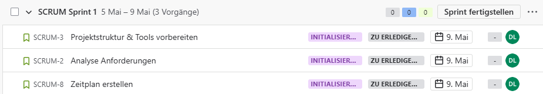
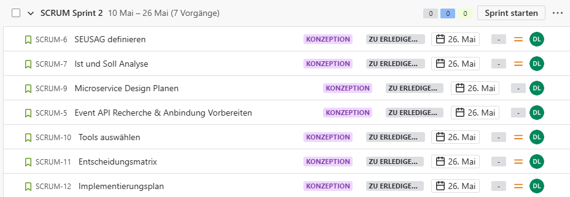
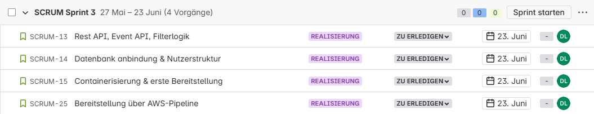
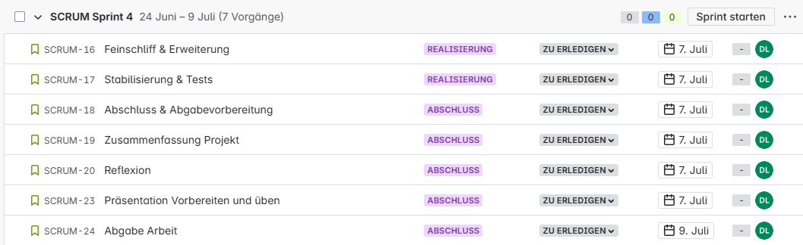

# Sprint Planning

Entwicklung eines Microservices für Event-Empfehlungen

**Zeitraum:** 05.05.2025 – 09.07.2025  
**Methode:** SCRUM  
**Anzahl Sprints:** 4 (Sprint 1 verkürzt)

## Sprint 1, 05.05 – 09.05 (5 Tage)

> Ziel: Das Projekt offiziell starten, die organisatorische Basis schaffen und erste technische Recherchen zur Event-API durchführen.

### Aufgaben

### Aufgabenverteilung

Alle Aufgaben werden von Laura Dubach umgesetzt.

### Nächste Schritte

- Sprintreview findet am: 09.05.2025 statt

## Sprint 2 10.05 – 26.05 (16 Tage)

> Ziel: Fachliches und technisches Konzept erstellen, Architekturentscheidungen treffen und Planung abschließen.

### Aufgabenverteilung

Alle Aufgaben werden von Laura Dubach umgesetzt.

### Nächste Schritte

- Sprintreview findet am: 02.06 statt

## Sprint 3: 27.05 – 23.06 (28 Tage)

> Ziel: Kernfunktionalität umsetzen: APIs, Datenbank, Containerisierung, sowie erste automatisierte Bereitstellung über AWS.

### Aufgabenverteilung

Alle Aufgaben werden von Laura Dubach umgesetzt.

### Nächste Schritte

- Sprintreview findet am: 20.06 statt

## Sprint 4: 24.06 – 09.07 (16 Tage)

> Ziel: Feinschliff, Absicherung durch Tests, Dokumentation und finale Abgabe.

### Priorisierung

1. Priorität
2. Priorität
3. Priorität

### Aufgabenverteilung

Alle Aufgaben werden von Laura Dubach umgesetzt.

### Nächste Schritte

- Sprintreview findet am: 20.06 statt
